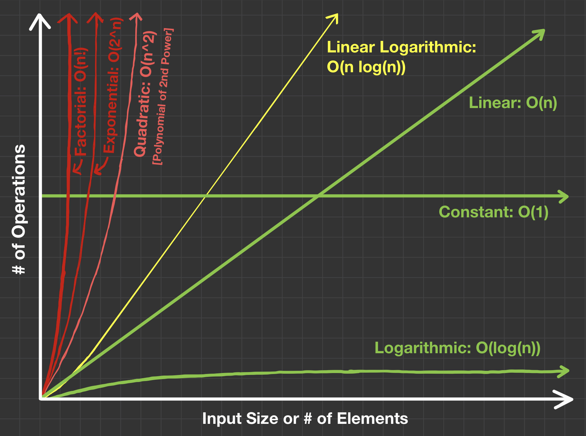

# Introduction to Big O Notation

"O" of "Big O" comes from “Order,” which is related to the rate of growth—for example, of time or space required to solve a given coding problem. Time complexity is used to describe the total runtime of a program. Space complexity is used to describe the total space/memory required to execute that program.

There are best cases, worst cases, average cases, and amortized situations. Usually, both time and space complexities are determined by the worst cases. Sometimes, we should consider average cases or amortized situations as well. However, we need to explicitly mention that we are considering an average case or an amortized situation.

It is important to note that we disregard the constants and non-dominant known terms when using the Big O notation. For example,  $O(n + n + …)$ is considered to be the same as $O(n)$ or $O(3n)$ as $O(n)$. Likewise, $O(n^2 + 2n)$ is considered to be the same as $O(n^2)$ or $O(3n + \log{n})$ as $O(n)$.

## Time Complexity

Total runtime of program depends on the sequential execution of statements in the code. Its final value is obtained by adding the times required by all the statements in the program.

Each statement is said to have a constant runtime complexity, $O(1)$, if its runtime is independent of the number of elements involved—for example, size of an input array or a string.

However, the runtime of a statement could be dependent on the given input. In that case, depending on the kind of operation being performed, it can be logarithmic, $O(\log{n})$, or linear logarithmic, $O(n \log{n})$, or linear, $O(n)$, or quadratic, $O(n^2)$, or polynomial, $O(n^m)$, or exponential, $O(m^n)$, or factorial $O(n!)$.

## Space Complexity

Space complexity is dependent on the data structures—for example, arrays, linked lists, stacks, queues, heaps, hash tables (maps), hash sets, tree, graphs, etc.—being used by the statements in a code. Also, it depends on the use of conditional statements, iterative approaches involving loops or nested loops (for, while, etc.), recursive approaches involving function and procedure calls, etc.